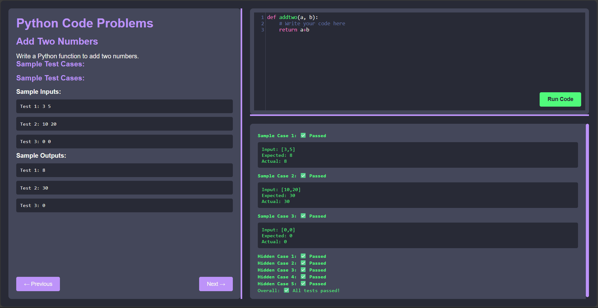

# **Online Python Program Evaluation Tool - Wipro Capstone Project**

## **Project Overview**
This project is an online platform for evaluating Python programs, designed to offer users a seamless experience in coding, testing, and receiving immediate feedback. The tool is built with **HTML, CSS, JavaScript, and Flask** for the backend, leveraging modern web development technologies to ensure a user-friendly interface and efficient evaluation process.

---

<strong>System Screen:</strong> 
  
</a>

---

## **Features**
- **User Authentication**: Users log in using email to access the tool.
- **Programming Questions Display**: Displays coding questions alongside an embedded coding area.
- **Real-Time Evaluation**: Executes Python code against predefined test cases and provides instant feedback.
- **Countdown Timer**: Tracks the time remaining for users to complete the test.
- **Result Display**: Displays scores and feedback on passed/failed test cases immediately after submission.

---

## **Tech Stack**
- **Frontend**: HTML, CSS, JavaScript
- **Backend**: Python (Flask)
- **Code Editor**: CodeMirror
- **Database**: Excel (Initially)
- **Version Control**: Git and GitHub
- **Deployment**: Flask server (local)

---

## 👤 Author
**Sowndappan S**
Email: santoshsowndappan@gmail.com

**Mythili S**

**Kowsika H**

---
